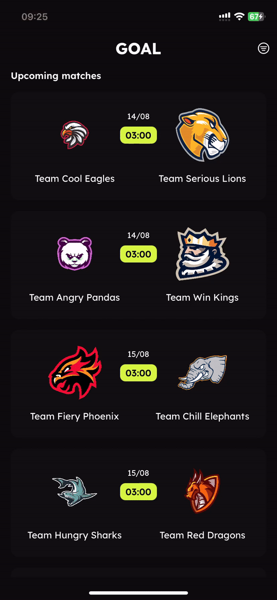

# Goal app

Goal app allow users to view the list of upcoming matches and previous matches. 

## Features
- List of recent and upcoming matches
- List of recent and upcoming matches of a team 
- Watch hightlights video of a previous match
- (Bonus) Automatically change matches list layout when device is rotated 

## Code coverage 

| Class                | Coverage |
|----------------------|----------|
| MatchRepository      | 100%     |
| MatchesViewModel     | 100%     |
| TeamMatchesViewModel | 100%     |
| TeamsFilterViewModel | 100%     |

## Technical issues 

It took me a lot of time to resolve auto layout constraints conflicts. The root cause is UICollectionViewCell has itself UIView-Encapsulated-Layout-Height, and it leads to the conflicts with other constraints. 

I used `https://www.wtfautolayout.com` to confirm that my constraints are correct. And then tried to know what is UIView-Encapsulated-Layout-Height and how to resolve the conflict.

The lesson I learnt is how to debug layout constraints. 

## Screenshots

